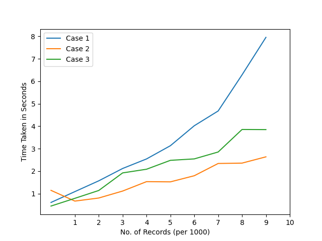

# Multithreading and File Based ELT (Extract Load Transform)  📅🪙

This projects aims to compare methods of applying ELT on databases on different number of records and compare results for the same. The three different methods adopted are : 

1. <b>Case 1:</b> Take records one by one from the database , transform it and store it back in the new database.

2. <b>Case 2: </b> Export Database to a CSV file, apply transformations to the CSV file and convert this file back to database.

3. <b> Case 3: (Extension of Case 2 using multithreading) </b> File Created in Case 2 can be split into various files each having various number of records. Find ideal number of splits that should be done and apply multithreading pipeline (Producer Consumer Problem) to transform each file seperately and store it back into the database.

## Results : 

The plot and table for different no. of records for each case is shown below : 

## Table Wise Results
 

| Number of Records | Time Taken (Case 1)| Time Taken (Case 2) | Time Taken (Case 3) 
| ------------- | --------- | --------- | --------- |
| 100  | 0.60 s  |  1.144 s |  0.44 s  | 
| 200  | 1.08 s  |  0.66 s  |  0.79 s  | 
| 300  | 1.56 s  |  0.80 s  |  1.13 s  | 
| 400  | 2.11 s  |  1.11 s  |  1.92 s  | 
| 500  | 2.54 s  |  1.53 s  |  2.08 s  | 
| 600  | 3.14 s  |  1.52 s  |  2.48 s  | 
| 700  | 4.02 s  |  1.79 s  |  2.54 s  | 
| 800  | 5.08 s  |  2.34 s  |  2.85 s  | 
| 900  | 7.23 s  |  2.35 s  |  3.85 s  | 
| 1000 | 8.05 s  |  2.63 s  |  3.84 s  | 
